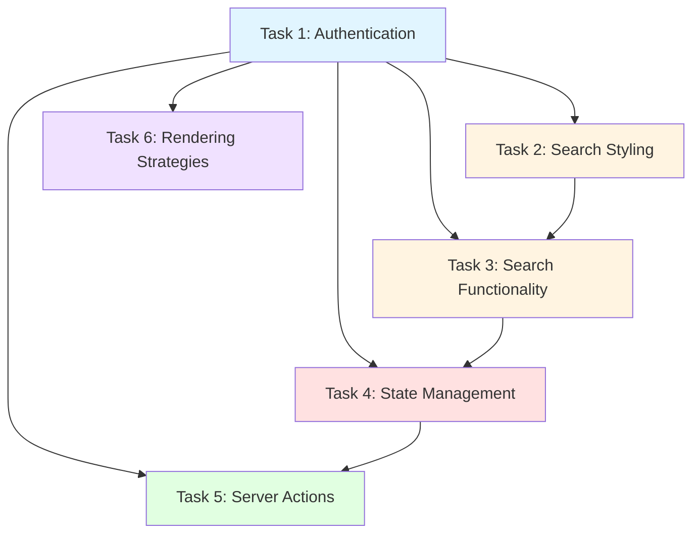

# SpaceX Launches Viewer - Implementation Plan

## 1. Normalized Requirements

### Task 1: Authentication
- Implement [`login()`](react/src/api/admin.ts:3) function in [`src/api/admin.ts`](react/src/api/admin.ts) to call `/admin/token` endpoint
- Connect [`Login`](react/src/views/Login/index.tsx:4) view's [`handleLogin()`](react/src/views/Login/index.tsx:5) to the login API
- Save JWT token via [`AuthContext`](react/src/contexts/AuthContext.tsx:18)
- Redirect to Home page (Launches List) upon successful authentication
- **Ambiguity**: What `userId` should be sent to the `/admin/token` endpoint? The backend requires a `userId` in the request body.

### Task 2: Search Component Styling
- Style the [`Search`](react/src/components/Search/index.tsx:11) component in [`src/components/Search/index.scss`](react/src/components/Search/index.scss:1)
- Make it look professional (reference existing design patterns in [`LaunchCard`](react/src/components/LaunchCard/index.scss:1) and [`Layout`](react/src/components/Layout/index.scss:1))
- Can use Tailwind CSS or complete the SCSS file
- **Ambiguity**: No Figma reference provided - need to infer design from existing components

### Task 3: Search Functionality
- Complete the [`filterLaunches()`](react/src/containers/LaunchesList/index.tsx:16) function in [`src/containers/LaunchesList/index.tsx`](react/src/containers/LaunchesList/index.tsx:9)
- Filter launches by `mission_name` based on [`searchText`](react/src/containers/LaunchesList/index.tsx:12) state
- Maintain existing mode filtering (All vs Favorites)

### Task 4: State Management for Favorites
- Fix favorite star icon in [`LaunchCard`](react/src/components/LaunchCard/index.tsx:11) to update local state efficiently
- Currently [`updateFavorite`](react/src/components/LaunchesList/index.tsx:53) is an empty function
- The [`handleClickFavorite()`](react/src/components/LaunchCard/index.tsx:12) calls API but doesn't update local state
- Need to propagate state changes from [`LaunchCard`](react/src/components/LaunchCard/index.tsx:11) to [`LaunchesList`](react/src/containers/LaunchesList/index.tsx:9)

### Task 5: Server Actions (Next.js 16)
- Implement [`toggleFavorite()`](react/src/app/actions.ts:3) Server Action in [`src/app/actions.ts`](react/src/app/actions.ts:1)
- Handle API call on server side (POST/DELETE to `/launches/:flight_number/favorite`)
- Discuss integration with client-side list using `useOptimistic` or revalidation
- **Consideration**: Server Actions need to handle authentication (JWT token)

### Task 6: Rendering Strategies
- Implement server-side fetched version of launches list in [`src/app/rendering/page.tsx`](react/src/app/rendering/page.tsx:1)
- Compare CSR (current [`Home`](react/src/app/page.tsx:9) page) vs SSR/RSC approaches
- Discuss performance and UX differences

---

## 2. Subtask Breakdown

### Task 1: Authentication

#### Subtask 1.1: Implement login API function
- **Purpose**: Connect to `/admin/token` endpoint to get JWT
- **Affected files**: [`src/api/admin.ts`](react/src/api/admin.ts:1)
- **Dependencies**: None
- **Details**:
  - Call `POST /admin/token` with a `userId` in request body
  - Return the JWT token from response
  - Handle errors appropriately

#### Subtask 1.2: Implement handleLogin in Login view
- **Purpose**: Connect login button to API and save token
- **Affected files**: [`src/views/Login/index.tsx`](react/src/views/Login/index.tsx:1)
- **Dependencies**: Subtask 1.1
- **Details**:
  - Import and call [`login()`](react/src/api/admin.ts:3) from [`src/api/admin.ts`](react/src/api/admin.ts:1)
  - Use [`setToken()`](react/src/contexts/AuthContext.tsx:15) from [`AuthContext`](react/src/contexts/AuthContext.tsx:18) to save JWT
  - Add loading state and error handling
  - **Note**: [`AuthContext`](react/src/contexts/AuthContext.tsx:23) already handles redirect to `/` when token is set

#### Subtask 1.3: Verify AuthContext integration
- **Purpose**: Ensure token is properly saved and used
- **Affected files**: [`src/contexts/AuthContext.tsx`](react/src/contexts/AuthContext.tsx:1), [`src/utils/axios.ts`](react/src/utils/axios.ts:1)
- **Dependencies**: Subtask 1.2
- **Details**:
  - Verify token is saved to localStorage
  - Verify token is added to axios default headers
  - Verify redirect works correctly

---

### Task 2: Search Component Styling

#### Subtask 2.1: Design Search component styles
- **Purpose**: Create professional-looking search input
- **Affected files**: [`src/components/Search/index.scss`](react/src/components/Search/index.scss:1)
- **Dependencies**: None
- **Details**:
  - Style the `.search-input` container
  - Style the input field (padding, border, focus states)
  - Style the search icon (position, size)
  - Style the close icon (position, visibility based on value)
  - Match existing dark theme from [`LaunchCard`](react/src/components/LaunchCard/index.scss:1) and [`Layout`](react/src/components/Layout/index.scss:1)
  - Consider hover and focus states for better UX

#### Subtask 2.2: (Optional) Add close icon visibility logic
- **Purpose**: Only show close icon when there's text to clear
- **Affected files**: [`src/components/Search/index.tsx`](react/src/components/Search/index.tsx:11)
- **Dependencies**: None
- **Details**:
  - Add conditional rendering or CSS class for close icon
  - Hide close icon when `value` is empty

---

### Task 3: Search Functionality

#### Subtask 3.1: Implement mission_name filtering
- **Purpose**: Filter launches by mission name
- **Affected files**: [`src/containers/LaunchesList/index.tsx`](react/src/containers/LaunchesList/index.tsx:9)
- **Dependencies**: None
- **Details**:
  - Update [`filterLaunches()`](react/src/containers/LaunchesList/index.tsx:16) to filter by `mission_name`
  - Use case-insensitive search
  - Combine with existing mode filter (All vs Favorites)
  - Reset to page 1 when search changes (already done)

---

### Task 4: State Management for Favorites

#### Subtask 4.1: Implement updateFavorite callback in LaunchesList
- **Purpose**: Update local state when favorite is toggled
- **Affected files**: [`src/containers/LaunchesList/index.tsx`](react/src/containers/LaunchesList/index.tsx:9)
- **Dependencies**: None
- **Details**:
  - Create [`updateFavorite()`](react/src/containers/LaunchesList/index.tsx:53) function
  - Update the `launches` state to toggle `favorite` property
  - Pass this function to [`LaunchCard`](react/src/components/LaunchCard/index.tsx:11) via props

#### Subtask 4.2: Update LaunchCard to use updateFavorite callback
- **Purpose**: Call parent's updateFavorite after API call
- **Affected files**: [`src/components/LaunchCard/index.tsx`](react/src/components/LaunchCard/index.tsx:11)
- **Dependencies**: Subtask 4.1
- **Details**:
  - Update [`handleClickFavorite()`](react/src/components/LaunchCard/index.tsx:12) to call [`updateFavorite`](react/src/components/LaunchCard/index.tsx:8) after API call
  - Handle optimistic updates (optional but recommended)

#### Subtask 4.3: (Optional) Add error handling for favorite toggle
- **Purpose**: Revert state if API call fails
- **Affected files**: [`src/components/LaunchCard/index.tsx`](react/src/components/LaunchCard/index.tsx:11)
- **Dependencies**: Subtask 4.2
- **Details**:
  - Wrap API call in try-catch
  - Revert optimistic update on error
  - Show error message to user

---

### Task 5: Server Actions (Next.js 16)

#### Subtask 5.1: Implement toggleFavorite Server Action
- **Purpose**: Handle favorite toggle on server side
- **Affected files**: [`src/app/actions.ts`](react/src/app/actions.ts:1)
- **Dependencies**: None
- **Details**:
  - Import axios or fetch for API calls
  - Call appropriate endpoint (POST or DELETE) based on current state
  - Handle authentication (need to pass JWT token)
  - Use `revalidatePath()` to refresh data
  - Return success/error response

#### Subtask 5.2: Create client-side integration for Server Action
- **Purpose**: Integrate Server Action with client-side list
- **Affected files**: [`src/components/LaunchCard/index.tsx`](react/src/components/LaunchCard/index.tsx:11) or new component
- **Dependencies**: Subtask 5.1
- **Details**:
  - Option A: Use `useOptimistic` hook for instant UI feedback
  - Option B: Use `revalidatePath()` to refresh data after action
  - Discuss trade-offs in comments

#### Subtask 5.3: Document Server Action integration approach
- **Purpose**: Document the chosen approach and its trade-offs
- **Affected files**: [`src/app/actions.ts`](react/src/app/actions.ts:1) or separate documentation
- **Dependencies**: Subtask 5.2
- **Details**:
  - Explain why `useOptimistic` or `revalidatePath` was chosen
  - Discuss performance implications
  - Discuss UX implications

---

### Task 6: Rendering Strategies

#### Subtask 6.1: Create Server Component for launches list
- **Purpose**: Implement SSR version of launches list
- **Affected files**: [`src/app/rendering/page.tsx`](react/src/app/rendering/page.tsx:1)
- **Dependencies**: None
- **Details**:
  - Fetch data directly in the Server Component using async/await
  - Create a new client component for interactive parts (search, pagination, favorites)
  - Pass fetched data as props to client component
  - Handle authentication (Server Components can't access localStorage)

#### Subtask 6.2: Create comparison documentation
- **Purpose**: Document differences between CSR and SSR approaches
- **Affected files**: [`src/app/rendering/page.tsx`](react/src/app/rendering/page.tsx:1) or separate documentation
- **Dependencies**: Subtask 6.1
- **Details**:
  - Performance comparison (initial load, TTFB, hydration)
  - UX comparison (loading states, interactivity)
  - SEO implications
  - Complexity comparison

#### Subtask 6.3: (Optional) Implement both versions side-by-side
- **Purpose**: Allow visual comparison of CSR vs SSR
- **Affected files**: [`src/app/rendering/page.tsx`](react/src/app/rendering/page.tsx:1)
- **Dependencies**: Subtask 6.1
- **Details**:
  - Render both CSR and SSR versions on the same page
  - Add labels to distinguish them
  - Add performance metrics display

---

## 3. System & Structural Impact

### Directly Affected Files

| File | Tasks | Impact |
|------|-------|--------|
| [`src/api/admin.ts`](react/src/api/admin.ts:1) | Task 1 | Add login implementation |
| [`src/views/Login/index.tsx`](react/src/views/Login/index.tsx:1) | Task 1 | Connect to login API |
| [`src/components/Search/index.scss`](react/src/components/Search/index.scss:1) | Task 2 | Add styles |
| [`src/components/Search/index.tsx`](react/src/components/Search/index.tsx:11) | Task 2 (optional) | Add close icon visibility |
| [`src/containers/LaunchesList/index.tsx`](react/src/containers/LaunchesList/index.tsx:9) | Tasks 3, 4 | Add filtering and state management |
| [`src/components/LaunchCard/index.tsx`](react/src/components/LaunchCard/index.tsx:11) | Task 4, 5 | Add updateFavorite callback, Server Action integration |
| [`src/app/actions.ts`](react/src/app/actions.ts:1) | Task 5 | Implement Server Action |
| [`src/app/rendering/page.tsx`](react/src/app/rendering/page.tsx:1) | Task 6 | Implement SSR version |

### Indirectly Affected Files

| File | Tasks | Impact |
|------|-------|--------|
| [`src/contexts/AuthContext.tsx`](react/src/contexts/AuthContext.tsx:1) | Task 1 | Already handles token storage and redirect - verify works correctly |
| [`src/utils/axios.ts`](react/src/utils/axios.ts:1) | Task 1, 5 | Used for API calls - verify token header is set correctly |
| [`src/api/favorites.ts`](react/src/api/favorites.ts:1) | Task 4, 5 | Used by LaunchCard - may be replaced by Server Action |
| [`src/api/launches.ts`](react/src/api/launches.ts:1) | Task 6 | Used for fetching launches - may need server-side version |
| [`src/types/launch.ts`](react/src/types/launch.ts:1) | All | Type definitions - verify no changes needed |

### Interfaces, Types, or Contracts at Risk

1. **[`Launch`](react/src/types/launch.ts:3) interface**: The `favorite` property is critical for Tasks 3, 4, and 5. Any changes to this interface will affect multiple components.

2. **[`AuthProviderValue`](react/src/contexts/AuthContext.tsx:13) interface**: The token management is critical for authentication. Changes here affect the entire app's auth flow.

3. **[`SeachProps`](react/src/components/Search/index.tsx:6) interface**: The Search component's props interface. Changes here affect how [`LaunchesList`](react/src/containers/LaunchesList/index.tsx:9) uses the Search component.

4. **[`LaunchCardProps`](react/src/components/LaunchCard/index.tsx:6) interface**: The `updateFavorite` prop is critical for Task 4. Currently it's typed as `Function` - should be more specific.

5. **API contracts**:
   - `/admin/token` endpoint: Requires `userId` in request body, returns `{ token }`
   - `/launches` endpoint: Requires auth header, returns array of [`Launch`](react/src/types/launch.ts:3)
   - `/launches/:flight_number/favorite` endpoint: POST to add, DELETE to remove

### Potential Regressions or Side Effects

1. **Authentication flow**: If [`AuthContext`](react/src/contexts/AuthContext.tsx:23) doesn't properly handle token storage, the entire app's auth will break.

2. **Search filtering**: If [`filterLaunches()`](react/src/containers/LaunchesList/index.tsx:16) doesn't properly combine search and mode filters, users may see incorrect results.

3. **Favorite state**: If local state isn't updated after API call, the UI won't reflect changes until page refresh.

4. **Server Actions**: If Server Actions don't handle authentication properly, they will fail when called from client components.

5. **SSR implementation**: If Server Component doesn't handle authentication correctly, it will fail to fetch data (Server Components can't access localStorage).

6. **Pagination**: If filtering changes the number of items, pagination must recalculate correctly.

---

## 4. Assumptions & Open Questions

### Assumptions

1. **userId for login**: The backend `/admin/token` endpoint requires a `userId` in the request body. I assume a hardcoded value (e.g., "1") or a user input field is acceptable.

2. **Backend endpoints exist**: The backend has the following endpoints:
   - `POST /admin/token` - returns JWT
   - `GET /launches` - returns launches with favorite status
   - `POST /launches/:flight_number/favorite` - adds to favorites
   - `DELETE /launches/:flight_number/favorite` - removes from favorites

3. **Backend favorites routes**: The backend favorites routes in [`node/src/routes/favorites.ts`](node/src/routes/favorites.ts:1) only have a GET endpoint. The POST and DELETE endpoints for `/launches/:flight_number/favorite` may need to be added to the backend.

4. **Design consistency**: The Search component should match the existing dark theme and design patterns from [`LaunchCard`](react/src/components/LaunchCard/index.scss:1) and [`Layout`](react/src/components/Layout/index.scss:1).

5. **Search behavior**: Search should be case-insensitive and match partial strings.

6. **Optimistic updates**: For better UX, favorite toggles should use optimistic updates (update UI immediately, then call API).

7. **Server Action authentication**: Server Actions will need to receive the JWT token from the client (via cookies or headers) since they can't access localStorage.

### Open Questions

1. **What userId should be sent to `/admin/token` endpoint?**
   - Should it be hardcoded?
   - Should there be a user input field?
   - Should it be derived from somewhere else?

2. **Are the POST and DELETE endpoints for `/launches/:flight_number/favorite` implemented in the backend?**
   - The [`node/src/routes/favorites.ts`](node/src/routes/favorites.ts:1) only shows a GET endpoint
   - The [`node/src/controllers/favorites.ts`](node/src/controllers/favorites.ts:1) has `addFavorite` and `removeFavorite` functions but they're not registered in routes

3. **Should the Search component use SCSS or Tailwind CSS?**
   - The project has both configured
   - Existing components use SCSS
   - Tailwind is available and configured

4. **How should Server Actions handle authentication?**
   - Should JWT be passed via cookies?
   - Should it be passed as a parameter?
   - Should a different auth mechanism be used?

5. **Should the SSR version in [`src/app/rendering/page.tsx`](react/src/app/rendering/page.tsx:1) be a separate route or a comparison page?**
   - Should it replace the CSR version?
   - Should it be a separate page for comparison?

6. **Should the favorite toggle use optimistic updates?**
   - This affects UX and error handling complexity

7. **What is the expected behavior when search returns no results?**
   - Should there be a "no results" message?
   - Should the pagination be hidden?

---

## 5. Dependencies Between Tasks

### Dependency Explanation

- **Task 1 (Authentication)** is a prerequisite for all other tasks because:
  - The API endpoints require authentication
  - The favorites functionality requires a user context
  - Server Actions need to handle authenticated requests

- **Task 2 (Search Styling)** and **Task 3 (Search Functionality)** are independent but related:
  - Task 2 is visual only
  - Task 3 is functional
  - They can be done in parallel

- **Task 4 (State Management)** depends on **Task 3**:
  - The favorite state management works with the filtered list
  - Both operate on the same data structure

- **Task 5 (Server Actions)** depends on **Task 4**:
  - Server Actions are an alternative to the client-side approach in Task 4
  - Understanding the client-side approach helps design the Server Action

- **Task 6 (Rendering Strategies)** is independent but benefits from understanding other tasks:
  - It's a separate exploration of rendering approaches
  - Can be done in parallel with other tasks

---

## 6. Implementation Order Recommendation

Based on dependencies and complexity, the recommended implementation order is:

1. **Task 1: Authentication** (Foundation - required for all other tasks)
2. **Task 2: Search Styling** (Quick win - visual only)
3. **Task 3: Search Functionality** (Quick win - simple logic)
4. **Task 4: State Management** (Medium complexity - state updates)
5. **Task 5: Server Actions** (High complexity - Next.js 16 feature)
6. **Task 6: Rendering Strategies** (Exploratory - can be done anytime)

---

## 7. Potential Issues and Considerations

### Backend Issues

1. **Missing favorites routes**: The backend may not have POST and DELETE endpoints for `/launches/:flight_number/favorite`. These may need to be added to [`node/src/routes/favorites.ts`](node/src/routes/favorites.ts:1).

2. **Auth middleware**: The [`auth`](node/src/middlewares/auth.ts:1) middleware in the backend is currently a no-op (`return next()`). It should validate the JWT token.

3. **processLaunches implementation**: The [`processLaunches`](node/src/services/launches.ts:4) function returns an empty array. It should process launches and add favorite status.

### Frontend Issues

1. **Type safety**: The [`updateFavorite`](react/src/components/LaunchCard/index.tsx:8) prop is typed as `Function`. It should be more specific.

2. **Error handling**: Most API calls lack proper error handling. This should be added.

3. **Loading states**: The Login view and other components lack loading states. This affects UX.

4. **Token persistence**: The token is saved to localStorage but not loaded on app initialization. Users will need to log in again on refresh.

### Next.js 16 Specific Considerations

1. **Server Actions**: Server Actions are a new feature in Next.js 16. They require careful handling of authentication and state.

2. **useOptimistic**: This hook is useful for optimistic updates but requires careful implementation to avoid race conditions.

3. **Server Components**: Server Components can't use hooks or access browser APIs. Interactive parts must be client components.

4. **revalidatePath**: This function is used to refresh data after Server Actions. It requires understanding of Next.js caching.

---

## 8. Code Quality Considerations

### DRY (Don't Repeat Yourself)

- The favorite toggle logic appears in multiple places ([`LaunchCard`](react/src/components/LaunchCard/index.tsx:11), potential Server Action). Consider extracting to a shared utility.

- The API call patterns are similar across [`admin.ts`](react/src/api/admin.ts:1), [`favorites.ts`](react/src/api/favorites.ts:1), and [`launches.ts`](react/src/api/launches.ts:1). Consider a generic API wrapper.

### KISS (Keep It Simple, Stupid)

- For Task 4, a simple state update is sufficient. No need for complex state management libraries.

- For Task 5, start with a simple Server Action before adding `useOptimistic`.

- For Task 6, implement a basic SSR version before adding complex comparisons.

### Performance Considerations

- Search filtering should be debounced if the API is called on each keystroke (currently it's client-side filtering, so debouncing is not needed).

- Favorite toggles should use optimistic updates for better perceived performance.

- SSR version should use caching to avoid unnecessary API calls.

---

## 9. Testing Considerations

### Unit Tests

- Test [`login()`](react/src/api/admin.ts:3) function with success and error cases
- Test [`filterLaunches()`](react/src/containers/LaunchesList/index.tsx:16) with various search terms
- Test [`toggleFavorite()`](react/src/app/actions.ts:3) Server Action

### Integration Tests

- Test authentication flow (login → token storage → redirect)
- Test search functionality with real data
- Test favorite toggle with API calls

### E2E Tests

- Test complete user journey: login → search → favorite → logout

---

## 10. Documentation

### Code Comments

- Add comments explaining the search filtering logic
- Add comments explaining the favorite state management approach
- Add comments explaining the Server Action integration

### README Updates

- Update [`react/readme.md`](react/readme.md:1) with implementation details
- Add environment variable documentation
- Add API endpoint documentation

---

## Summary

This implementation plan provides a detailed breakdown of all tasks in [`react/readme.md`](react/readme.md:1). The plan includes:

1. **6 main tasks** broken down into **18 subtasks**
2. **8 directly affected files** and **5 indirectly affected files**
3. **5 interfaces/types at risk** of changes
4. **6 potential regressions** to watch for
5. **7 assumptions** and **7 open questions**
6. **Dependency graph** showing task relationships
7. **Recommended implementation order**
8. **Backend and frontend issues** to address
9. **Code quality considerations** (DRY, KISS, performance)
10. **Testing considerations** (unit, integration, E2E)
11. **Documentation recommendations**

The plan follows the principles of DRY and KISS, identifies dependencies between tasks, and highlights potential issues and considerations.
